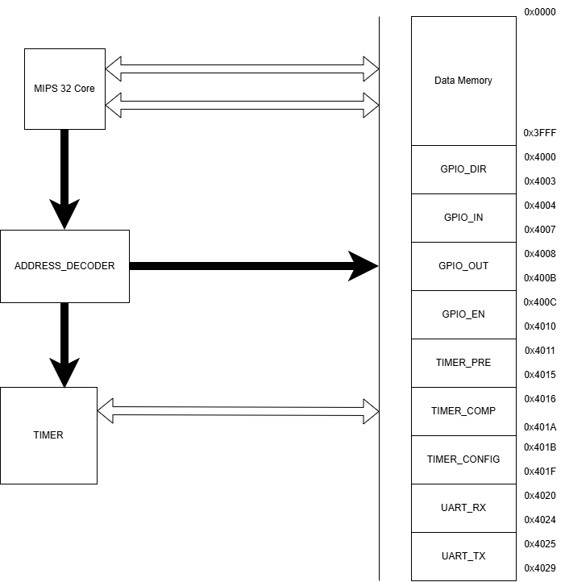
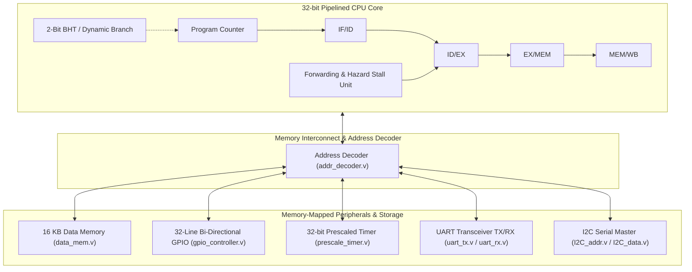

# M32 Microcontroller System-on-Chip (SkyWater 130nm)


-green)


-orange)


A tape-out-ready 32-bit Microcontroller System-on-Chip (SoC) featuring a hazard-resolved pipelined CPU core, on-chip memory, and memory-mapped peripheral subsystems (UART, I2C, Timers, GPIO). The entire SoC is hardened through the open-source **OpenLane / OpenROAD ASIC flow** down to GDSII using the **SkyWater 130nm CMOS PDK (`sky130A`)**.

---

## 📸 Physical Implementation & Chip Layout

| Chip Die Layout (SkyWater 130nm) | Detailed Routing & Cell Placement |
| :---: | :---: |
|  |  |

---

## 🏛️ Top-Level SoC Architecture & Block Diagram





---

## 🗺️ Unified Memory Map

The CPU datapath communicates with peripherals via dedicated memory-mapped address ranges decoded by `addr_decoder.v`:

| Address Range | Subsystem / Peripheral | Description | Control Signals |
| :--- | :--- | :--- | :--- |
| `0x0000_0000 – 0x0000_3FFF` | **Data RAM (16 KB)** | Synchronous internal scratchpad RAM | `dm = 1` |
| `0x0000_0010 – 0x0000_001F` | **GPIO Subsystem** | 32-bit bidirectional I/O, direction masks, input/output registers | `ga, gina, gena, drina` |
| `0x0000_0020 – 0x0000_002F` | **Prescaled Timer** | 32-bit down-counter, prescaler divider, overflow interrupts | `tc, tp, t_cnf` |
| `0x0000_0040 – 0x0000_004F` | **UART Transceiver** | Full-duplex TX/RX FIFO buffers, baud-rate generator | `ut, ur, ue` |
| `0x0000_0060 – 0x0000_006F` | **I2C Master** | 2-wire serial master address/data controllers | `i2c_addr, i2c_data` |

---

## 📊 Physical Design & Synthesis Metrics

The design was hardened using the OpenLane ASIC flow targeting the `sky130_fd_sc_hd` standard cell library.

| Metric | Measured Value | Source Report |
| :--- | :--- | :--- |
| **PDK Process Node** | SkyWater 130nm CMOS (`sky130A`) | `config.json` |
| **Standard Cell Count** | **10,476 cells** | `reports/synthesis/1-synthesis.AREA_0.stat.rpt` |
| **Internal Nets / Wires** | **10,447 nets** (10,478 bits) | `reports/synthesis/1-synthesis.AREA_0.stat.rpt` |
| **Target Clock Period** | **10.0 ns (100 MHz)** | `constraints/clock.sdc` |
| **Clock Tree Synthesis (CTS)**| Completed with balanced skew buffers | `reports/cts/` |
| **Post-Route Timing (STA)** | Validated across setup / hold corners | `reports/synthesis/2-syn_sta.summary.rpt` |

---

## 📁 Repository Structure & ASIC Deliverables

```
M32_MCU_V1/
├── config.json                     # OpenLane ASIC flow configuration
├── constraints/
│   └── clock.sdc                   # SDC timing constraints (100 MHz target clock)
├── rtl/                            # Synthesizable Verilog RTL source (41 modules)
│   ├── top.v                       # Top-level SoC integration
│   ├── addr_decoder.v              # Interconnect bus address decoder
│   ├── bht.v                       # 2-bit Dynamic Branch History Table
│   ├── fwd_unit.v / stall_unit.v   # Pipeline hazard forwarding & load-use stall logic
│   ├── gpio_controller.v           # 32-channel bidirectional GPIO
│   ├── prescale_timer.v            # 32-bit programmable timer
│   ├── uart_tx.v / uart_rx.v       # Full-duplex UART transceiver
│   └── I2C_addr.v / I2C_data.v     # I2C serial protocol controller
├── reports/                        # Implementation logs & verification sign-off
│   ├── synthesis/                  # Cell count statistics, gate-level STA reports
│   └── cts/                        # Clock tree synthesis buffer insertion reports
├── results/final/                  # Final Tape-out Sign-off Artifacts
│   ├── gds/                        # Tape-out ready GDSII stream file
│   ├── def/                        # Placed & routed Design Exchange Format
│   ├── lef/ & maglef/              # Abstract layout models for hierarchical reuse
│   ├── spef/                       # Standard Parasitic Extraction (RC parasitics)
│   ├── sdf/                        # Standard Delay Format for gate-level timing sim
│   ├── spi/lvs/                    # Extracted SPICE netlist for LVS verification
│   └── verilog/gl/                 # Post-layout gate-level netlist
├── screenshots/                    # Die layout captures and architectural schematics
└── synth_yosys/                    # Standalone Yosys synthesis flow & gate-level netlist
```

---

## 🛠️ Verification & Implementation Flow

### 1. Functional Simulation (Icarus Verilog):
```bash
# Compile top-level SoC with testbench
iverilog -o sim/mcu_sim.vvp rtl/*.v tb/tb_top.v

# Execute simulation
vvp sim/mcu_sim.vvp

# Inspect pipeline and peripheral waveforms
gtkwave sim/waveform.vcd
```

### 2. Standalone Logic Synthesis (Yosys):
```bash
cd synth_yosys
yosys synth.ys
```

### 3. OpenLane ASIC Flow (RTL-to-GDSII):
```bash
# Run automated OpenLane flow targeting SkyWater 130nm
openlane config.json
```
